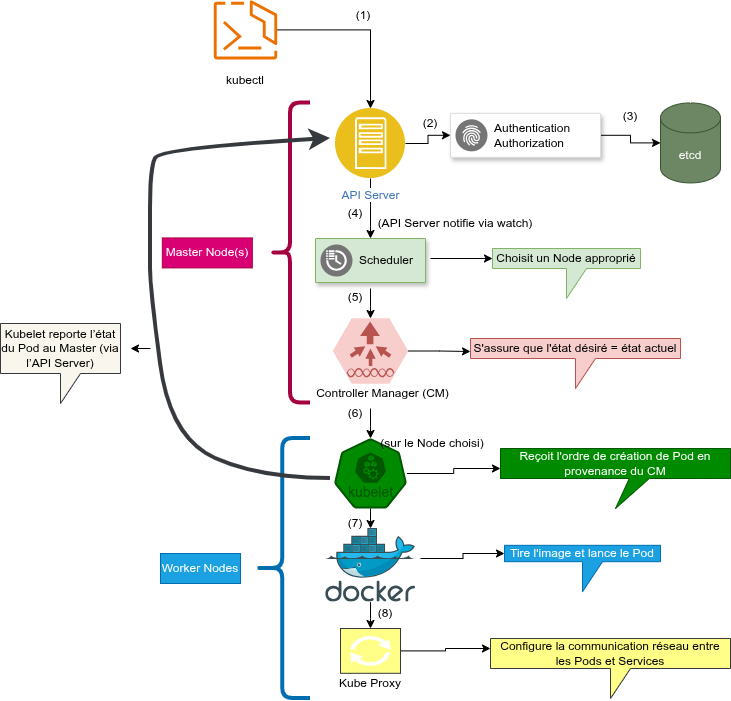

# KubeCloudOrchestrator
Projet démontrant l’orchestration d’applications multi-conteneurs avec Kubernetes, de la configuration au déploiement automatisé. Il analyse l’architecture, les avantages et les limites de Kubernetes face à Docker et aux machines virtuelles.

[TOC]

# **Qu’est-ce que Kubernetes ?**

Une **plateforme open-source d’orchestration de conteneurs** développée initialement par Google, aujourd’hui maintenue par la **Cloud Native Computing Foundation (CNCF)**.

Il permet de **déployer, gérer, mettre à l’échelle et maintenir** des applications conteneurisées de manière automatique.

### **Définition simple :**

Kubernetes est au conteneur ce qu’un système d’exploitation est à un ordinateur : il gère les ressources, planifie les tâches et garantit la disponibilité.


# ARCHITECTURE DE KUBERNETES [[2]](#ref2)


## Composantes principales

- Master Node (API Server, Controller Manager, Scheduler, etc.)
- Worker Nodes (Kubelet, Kube Proxy, Pod, Container Runtime(ex. Docker))


## Fonctionnement global et communication interne

### **1. Vue d’ensemble : le rôle de Kubernetes**

Un **cluster Kubernetes** est composé de :

- **1 Master Node** (ou plusieurs pour la haute disponibilité)
- **Plusieurs Worker Nodes**


### **2. Master Node, le cerveau du cluster**

C’est le **centre de contrôle** du cluster. Il gère **où et quand** exécuter les conteneurs, et surveille leur état.

| **a. API Server**                                            | **b. Scheduler**                                             |
| ------------------------------------------------------------ | ------------------------------------------------------------ |
| - C’est **l’interface centrale** entre les utilisateurs et le cluster. <br />- Tous les composants (kubectl, nodes, etc.) communiquent via cette API REST. <br />- Chaque commande kubectl (ex. kubectl get pods) passe par elle. | - Décide **sur quel nœud** chaque Pod doit être exécuté. <br />- Il se base sur :  les ressources disponibles (CPU, RAM), les contraintes de l’application (affinités, labels, etc.). |
| **Rôle :** point d’entrée unique pour gérer le cluster.      | **Rôle :** placement intelligent des Pods dans le cluster.   |
|                                                              |                                                              |
| **c. Controller Manager**                                    | **d. etcd**                                                  |
| - Surveille en permanence l’état du cluster. <br />- Compare **l’état désiré** (défini par les fichiers YAML) avec **l’état actuel**. <br />- Si un Pod crash, il le redéploie automatiquement. | - Base de données clé-valeur distribuée (type NoSQL).  <br />- Contient **toute la configuration du cluster** (état des Pods, des Services, des Secrets, etc.). |
| **Rôle :** maintenir le cluster conforme à la configuration voulue. | **Rôle :** stockage central de l’état global du cluster.     |
|                                                              |                                                              |
| **e. Authentication & Authorization**                        |                                                              |
| - Gère les identités et permissions (RBAC, comptes de service…).<br />- Contrôle **qui peut faire quoi** dans le cluster. |                                                              |
| **Rôle :** sécurité et contrôle d’accès.                     |                                                              |


### **3. Worker Nodes, les muscles du cluster**

Chaque Node (machine) exécute **les conteneurs réels**. Le Master leur dit quoi faire.

| **a. Kubelet**                                               | **b. Proxy (kube-proxy)**                                    |
| ------------------------------------------------------------ | ------------------------------------------------------------ |
| - Agent qui communique avec le Master. <br />- Reçoit les instructions du Scheduler (exécuter un Pod). <br />- Surveille la santé des conteneurs sur le node. | Gère le **trafic réseau** entrant et sortant des Pods. Met en place le **load balancing** interne et les **règles d’accès**. |
| **Rôle :** faire exécuter les Pods et rapporter leur état.   | **Rôle :** assurer la communication entre Pods et entre l’extérieur et le cluster. |
|                                                              |                                                              |
| **c. Docker (ou autre runtime comme containerd, CRI-O)**     | **d. Pods**                                                  |
| - Exécute les **conteneurs** eux-mêmes. <br />- Kubernetes n’exécute pas directement les conteneurs, il délègue à Docker/containerd. | - Unité de base d’exécution dans Kubernetes. <br />- Contient un ou plusieurs conteneurs qui partagent le même espace réseau et stockage. |
| **Rôle :** moteur d’exécution des conteneurs.                | **Rôle :** encapsule les conteneurs pour leur fournir un environnement cohérent. |


### **4. Communication et workflow**

1. L’utilisateur ou DevOps exécute une commande via **kubectl (CLI)**.
2. Cette commande est envoyée au **API Server** du Master Node.
3. Le Master enregistre la configuration dans **etcd**.
4. Le **Scheduler** choisit un Node adapté.
5. Le **Kubelet** du Node reçoit la consigne, et crée le Pod avec Docker.
6. Le **kube-proxy** s’assure que le trafic réseau fonctionne correctement.
7. Le **Controller Manager** vérifie que le Pod tourne bien.


### **5. Internet et Services**

Le schéma montre aussi une connexion avec Internet. Les Pods ne sont **pas directement exposés au monde extérieur**. Kubernetes utilise des **Services** (LoadBalancer, NodePort, Ingress) pour exposer les applications.

### **En résumé :**

| **Élément**                      | **Rôle**                                                     |
| -------------------------------- | ------------------------------------------------------------ |
| **API Server**                   | Point central de communication                               |
| **Scheduler**                    | Décide où placer les pods selon ressources et politiques.    |
| **Controller Manager**           | Surveille et maintient l’état désiré, orchestre controllers (DeploymentController, ReplicaSet, ...) |
| **etcd**                         | Base de données clé/valeur distribuée (source de vérité du cluster) |
| **Kubelet**                      | Agent sur chaque node qui exécute pods et rapporte l'état.   |
| **kube-proxy**                   | Assure la connectivité réseau et load-balancing au niveau Node. |
| **Docker/containerd**            | Exécute les conteneurs                                       |
| **Pod**                          | Unité de base d’exécution                                    |
| **kubectl**                      | Interface CLI pour interagir avec l’API                      |
| **Service (NodePort/ClusterIP)** | Abstraction réseau pour accéder aux pods.                    |


### **Exemple : déploiement d’une app Flask avec** **kubectl apply**

#### **1. Lancer une commande :** 

```bash
kubectl apply -f flask-deployment.yaml
```


#### **2. Communication entre les composants :**

Voici ce qui se passe étape par étape :

### **Flux complet:**



EXPLICATION:
---------------------

**kubectl (CLI)  -->  API Server**
**(1)** kubectl envoie une requête HTTP REST au Kubernetes API Server
    (ex: https://<master-ip>:6443) pour créer/modifier une ressource.

**API Server -> AuthN/AuthZ**
**(2)** L'API Server vérifie l'identité et permissions (Authentication & Authorization)
    (s'assure que l'utilisateur a le droit de créer le Deployment).

**API Server -> etcd (Distributed Storage)**
**(3)** Ressource validée : l'état désiré est persisté dans etcd
    (ex: "je veux 2 pods flask"; etcd stocke l'état désiré du cluster).

**Scheduler (notification)**
**(4)** Le Scheduler remarque la nouvelle ressource/pod à placer
    (choisit un Worker Node selon ressources, affinités, taints/tolerations).

**Controller Manager**
**(5)** Controller Manager compare état désiré vs état actuel
    (si mismatch, il ordonne au Kubelet du node choisi de créer le pod).

**Sur le Worker Node**
**(6) et (7)** Kubelet reçoit l'instruction et demande au Container Runtime (Docker/CRI) :

tirer l'image (flask-hello:1.0)
démarrer le conteneur (créer le Pod)
    (6b) Le Pod démarre et effectue son probe d'état (Readiness/Liveness).
    (6c) Kubelet signale l'état au Master (via API Server).

**Kube-Proxy et réseau**
**(8)** Kube-Proxy configure les règles réseau (iptables/ipvs) et le service
    (permet la découverte et la communication : autre pod <-> service NodePort:31181).


### **Ce qu’il faut retenir :**

- L’**API Server** est le **point central** : tout passe par lui.
- **etcd** ne parle **directement à personne** sauf à l’API Server.
- Le **Scheduler** et le **Controller Manager** observent l’état dans **etcd** via l’API Server (mécanisme *watch*).
- Le **Kubelet** ne crée rien seul : il agit **uniquement sur ordre du Master**.
  

### Modèle de virtualisation et isolation des conteneurs

------


## **Étude de cas : Déploiement d’une application Flask avec Kubernetes** [[1]](#ref1)

### Description de l’application Flask

C'est une application très simple qui affiche **"Hello World from Kubernetes!"** à l'écran.


### Environnement utilisé 

- **Minikube** : pour déployer un **cluster k8s local** pour les tests,
- **Docker** : utilisé comme **moteur de conteneurisation** (*container runtime*) pour exécuter les Pods.
- **kubectl** : **interface en ligne de commande (CLI)** servant à interagir avec le **k8s API Server** (création, inspection, gestion des ressources).


### Structure du projet 

Obtenue via la commande suivante

```bash
make tree
```

```basic
.
├── app
│   ├── app.py
│   └── __init__.py
├── conteneurs_système_de_k8s_.md
├── Dockerfile
├── Images
│   └── architecture.png
├── install_kubernetes_env.sh
├── k8s
│   ├── base
│   │   ├── configmap.yaml
│   │   ├── deployment.yaml
│   │   ├── kustomization.yaml
│   │   ├── secret.yaml
│   │   └── service.yaml
│   └── overlays
│       ├── dev
│       │   └── kustomization.yaml
│       └── prod
│           └── kustomization.yaml
├── LICENSE
├── Makefile
├── README.md
├── requirements.txt
└── run_system.sh
```


### Étapes de déploiement automatisé

Il y a le script [install_kubernetes_env.sh](./install_kubernetes_env.sh) qui automatise l'installation de Docker, kubectl et Minikube s'ils ne sont pas encore installés.

**Pour l'utiliser :**

```bash
make install-k8s_env
```

**Note** : Le script ne réinstallera jamais un composant déjà présent. Il affichera simplement sa version et passera au suivant.


**Déployer sur Kubernetes** dans l'un des deux modes possibles : 

1. **Développement** : lancer automatiquement le script [run_system.sh](./run_system.sh) en mode dev

   ```bash
   make auto-deploy-dev
   ```

2. **Production **: lancer automatiquement le script [run_system.sh](./run_system.sh) en mode prod

   ```bash
   make auto-deploy-prod
   ```

------

#### Sortie attendue pour make auto-deploy-prod :

```basic
amolitho@amolitho:~/InsideKubernetes$ make auto-deploy-prod 
chmod +x run_system.sh
./run_system.sh --prod
==========================================
Déploiement en environnement: PROD
==========================================

[1/6] Vérification de Minikube...
Démarrage de Minikube...
😄  minikube v1.37.0 sur Ubuntu 24.04
✨  Utilisation du pilote virtualbox basé sur le profil existant
👍  Démarrage du nœud "minikube" primary control-plane dans le cluster "minikube"
🔄  Redémarrage du virtualbox VM existant pour "minikube" ...
🐳  Préparation de Kubernetes v1.34.0 sur Docker 28.4.0...
🔗  Configuration de bridge CNI (Container Networking Interface)...
🔎  Vérification des composants Kubernetes...
    ▪ Utilisation de l'image gcr.io/k8s-minikube/storage-provisioner:v5
🌟  Modules activés: default-storageclass, storage-provisioner

❗  /usr/bin/kubectl est la version 1.30.14, qui peut comporter des incompatibilités avec Kubernetes 1.34.0.
    ▪ Vous voulez kubectl v1.34.0 ? Essayez 'minikube kubectl -- get pods -A'
🏄  Terminé ! kubectl est maintenant configuré pour utiliser "minikube" cluster et espace de noms "default" par défaut.
✓ Minikube démarré

[2/6] Configuration de Docker pour Minikube...
✓ Docker pointe sur: minikube

[3/6] Build de l'image Docker...
✓ Image flask-hello:1.0 existe déjà, skip du build
✓ Image flask-hello:1.0 disponible

[4/6] Nettoyage des anciennes ressources...
Aucune ressource à supprimer

[5/6] Déploiement Kubernetes (prod)...
configmap/flask-config created
secret/flask-secret created
service/flask-service created
deployment.apps/flask-deployment created
Attente du démarrage des pods...
pod/flask-deployment-6dbf944f88-58xwl condition met
pod/flask-deployment-6dbf944f88-clslf condition met
pod/flask-deployment-6dbf944f88-f4sfs condition met
⚠ Timeout ou pods pas encore prêts, vérifiez avec 'kubectl get pods'

[6/6] État du déploiement:
==========================
NAME                                READY   STATUS    RESTARTS   AGE
flask-deployment-6dbf944f88-58xwl   1/1     Running   0          60s
flask-deployment-6dbf944f88-clslf   1/1     Running   0          60s
flask-deployment-6dbf944f88-f4sfs   1/1     Running   0          60s

NAME            TYPE        CLUSTER-IP     EXTERNAL-IP   PORT(S)          AGE
flask-service   NodePort    10.102.5.179   <none>        5600:31181/TCP   61s

==========================================
✓ Application déployée avec succès!
==========================================

URL d'accès:
http://192.168.59.101:31181

Commandes utiles:
  minikube service flask-service      # Ouvrir dans le navigateur
  kubectl logs -l app=flask-app       # Voir les logs
  kubectl get all                     # Voir toutes les ressources
  make delete-prod                  # Nettoyer
==========================================
```


**Voir toutes les ressources : *kubectl get all***

**Sortie attendue:** 

```basic
amolitho@amolitho:~/InsideKubernetes$ kubectl get all
NAME                                    READY   STATUS    RESTARTS   AGE
pod/flask-deployment-6dbf944f88-58xwl   1/1     Running   0          5m2s
pod/flask-deployment-6dbf944f88-clslf   1/1     Running   0          5m2s
pod/flask-deployment-6dbf944f88-f4sfs   1/1     Running   0          5m2s

NAME                    TYPE        CLUSTER-IP     EXTERNAL-IP   PORT(S)          AGE
service/flask-service   NodePort    10.102.5.179   <none>        5600:31181/TCP   5m3s
service/kubernetes      ClusterIP   10.96.0.1      <none>        443/TCP          5d1h

NAME                               READY   UP-TO-DATE   AVAILABLE   AGE
deployment.apps/flask-deployment   3/3     3            3           5m3s

NAME                                          DESIRED   CURRENT   READY   AGE
replicaset.apps/flask-deployment-6dbf944f88   3         3         3       5m3s
```

**Tenter de supprimer tout d'un coup**
```bash
kubectl delete all -l app=flask-app
```

**Sortie attendue:** 

```basic
amolitho@amolitho:~/InsideKubernetes$ kubectl delete all -l app=flask-app
pod "flask-deployment-6dbf944f88-58xwl" deleted
pod "flask-deployment-6dbf944f88-clslf" deleted
pod "flask-deployment-6dbf944f88-f4sfs" deleted
replicaset.apps "flask-deployment-6dbf944f88" deleted
```
**Vérifie toutes les ressources à nouveau : *kubectl get all***

**Sortie attendue:** 

```basic
amolitho@amolitho:~/InsideKubernetes$ kubectl get all
NAME                                    READY   STATUS    RESTARTS   AGE
pod/flask-deployment-6dbf944f88-4zsfs   1/1     Running   0          3m4s
pod/flask-deployment-6dbf944f88-72spq   1/1     Running   0          3m4s
pod/flask-deployment-6dbf944f88-scpwn   1/1     Running   0          3m4s

NAME                    TYPE        CLUSTER-IP     EXTERNAL-IP   PORT(S)          AGE
service/flask-service   NodePort    10.102.5.179   <none>        5600:31181/TCP   13m
service/kubernetes      ClusterIP   10.96.0.1      <none>        443/TCP          5d1h

NAME                               READY   UP-TO-DATE   AVAILABLE   AGE
deployment.apps/flask-deployment   3/3     3            3           13m

NAME                                          DESIRED   CURRENT   READY   AGE
replicaset.apps/flask-deployment-6dbf944f88   3         3         3       3m4s
```
Le résultat montre quelque chose d’important : Le Deployment flask-deployment n’a pas été supprimé, donc Kubernetes a automatiquement recréé trois nouveaux pods pour le remplacer.

En clair : On a supprimé les pods et le replica set, mais pas le Deployment, du coup, Kubernetes a détecté qu’il “manquait” des pods et les a recréés selon la définition du déploiement.

C’est le comportement normal et voulu d’un Deployment : il garantit qu’un nombre fixe de pods tourne en permanence.

Si on veut tout supprimer réellement, exécute :
```bash
kubectl delete deployment flask-deployment
kubectl delete service flask-service
```

Ensuite vérifie :
```bash
kubectl get all
```
On ne verra alors plus ni pods, ni deployment, ni service liés à ton app Flask.
```basic
NAME                 TYPE        CLUSTER-IP   EXTERNAL-IP   PORT(S)   AGE
service/kubernetes   ClusterIP   10.96.0.1    <none>        443/TCP   5d1h
```
On n’a plus que le service “kubernetes”, qui est généré automatiquement par le système pour permettre la communication interne entre les composants du cluster, c’est normal et on ne dois pas le supprimer.

Tout le reste (pods, services, déploiements Flask) a bien été supprimé.

L'environnement est donc prêt à :

être redéployé proprement (make auto-deploy-prod ou make auto-deploy-dev selon le besoin), ou être arrêté proprement via :
```bash
minikube stop
```


# **Analyse critique de Kubernetes**

## **Pourquoi utiliser k8s ?**

Sans Kubernetes, les développeurs déploient et gèrent les conteneurs (Docker, par exemple) manuellement.
Mais dès qu’on parle de **plusieurs serveurs, plusieurs conteneurs**, les problèmes apparaissent :

- Comment redémarrer un conteneur qui crash ?
- Comment distribuer la charge sur plusieurs machines ?
- Comment mettre à jour sans interruption ?
- Comment gérer des centaines de conteneurs ?

Kubernetes **automatise** tout ça.


### **Ses grands avantages :**

1. **Haute disponibilité** – redémarre automatiquement les conteneurs en cas de panne.
2. **Scalabilité** – augmente ou diminue automatiquement le nombre d’instances.
3. **Load balancing** – distribue le trafic entre les pods.
4. **Mises à jour continues** (rolling updates).
5. **Gestion simplifiée du déploiement** sur des environnements hybrides (on-premise ou cloud).

## **k8s apporte des solutions aux problèmes suivants**

| **Problème (avant K8s)**         | **Solution avec Kubernetes**                     |
| -------------------------------- | ------------------------------------------------ |
| Serveurs difficiles à configurer | Définis l'infra en YAML (Infrastructure-as-Code) |
| Déploiements manuels             | Automatisation via kubectl ou CI/CD              |
| Downtime lors des updates        | Rolling updates + rollbacks                      |
| Scaling manuel                   | Horizontal Pod Autoscaler                        |
| Monitoring complexe              | Intégration Prometheus / Grafana                 |
| Load balancing artisanal         | Services intégrés                                |
| Pannes imprévisibles             | Self-healing automatique                         |


------

## **Limites et inconvénients de Kubernetes**

### **1. Développement**

- **Courbe d’apprentissage élevée** : la compréhension des composants (API Server, etcd, Scheduler, Kubelet, etc.) demande du temps et une solide base en architecture système.
- **Complexité de configuration** : beaucoup d’abstractions (Pods, Services, Deployments, etc.) rendent difficile la configuration initiale et la détection d’erreurs.
- **Environnement lourd** : un cluster local (Minikube) consomme plusieurs Go de mémoire et des ressources CPU importantes, parfois difficile à faire tourner sur une machine personnelle.

------

### **2. Déploiement**

- **Configuration YAML volumineuse** : la gestion des fichiers YAML devient vite fastidieuse pour de gros projets.
- **Dépendances externes** : nécessite souvent des outils supplémentaires (Helm, Istio, ArgoCD, etc.) pour un déploiement fluide.
- **Debugging difficile** : il n’est pas évident de savoir quel composant traite une requête à un instant T. Il faut souvent passer par des logs, `kubectl describe`, `kubectl logs`, ou des outils d’observabilité comme Prometheus/Grafana.

------

### **3. En production**

- **Scalabilité et performance** : Kubernetes peut gérer une charge énorme, **mais pas seul**.
  - Pour des millions de paquets/seconde, il faut des **nœuds puissants**, une **infrastructure réseau optimisée**, et parfois **des solutions de load balancing externes** (NGINX Ingress, Envoy, MetalLB, etc.).
  - Le goulot d’étranglement peut venir du **plan de contrôle (API Server + etcd)** s’il n’est pas dimensionné correctement.
- **Complexité du débogage** : identifier une panne (Pod crash, réseau, volume, etc.) nécessite de croiser les logs de plusieurs composants.
- **Maintenance continue** : mises à jour fréquentes, gestion des versions, surveillance constante — Kubernetes **ne supprime pas la complexité**, il la **déplace**.

------


## **Bonnes pratiques d’utilisation de Kubernetes**

### **1. Développement**

- **Organisation modulaire** : créer une arborescence claire, par exemple :

  ```bash
  ├── k8s                  # Répertoire principal contenant les configurations Kubernetes
  │   ├── base             # Configuration de base commune à tous les environnements
  │   │   ├── configmap.yaml        # Définit les variables de configuration non sensibles
  │   │   ├── deployment.yaml    # Décrit le déploiement (pods, conteneurs, réplicas, etc.)
  │   │   ├── kustomization.yaml  # Fichier principal pour assembler les ressources de base
  │   │   ├── secret.yaml  # Contient les informations sensibles (mots de passe, clés API…)
  │   │   └── service.yaml # Définit l’accès réseau (exposition des pods via un service)
  │   └── overlays          # Configurations spécifiques à chaque environnement
  │       ├── dev           # Environnement de développement
  │       │   └── kustomization.yaml # Personnalisation de la base pour le dev (réplicas, image tag…)
  │       └── prod                 # Environnement de production
  │           └── kustomization.yaml # Personnalisation de la base pour la prod (scaling, ressources…)
  
  ```

  → Facilite la maintenance, les tests et le versionnement.

- **Automatisation** : utiliser un *Makefile* ou des scripts (`make deploy`, `make clean`, etc.) pour éviter les erreurs manuelles.

- **Gestion des ressources** : libérer les volumes, Pods ou images inutilisés (`kubectl delete`, `docker system prune`) pour économiser de l’espace.

- **Dimensionnement intelligent** : ajuster le nombre de *replicas* selon les besoins, avec une petite marge pour la résilience.

- **Documentation continue** : noter chaque configuration ou commande clé (README, Wiki interne).

------

### **2. Déploiement**

- **Vérification de la chaîne d’exécution** : s’assurer que Kubernetes utilise bien le runtime configuré (Docker, containerd, etc.) avant déploiement.

- **Validation continue** : appliquer `kubectl apply --dry-run=client -f …` pour tester les manifestes sans les exécuter réellement.

- **Observation active** : surveiller les événements et logs :

  ```bash
  kubectl get events --sort-by=.metadata.creationTimestamp
  kubectl logs <pod-name>
  ```

- **Rollback rapide** : toujours prévoir une stratégie de retour arrière (ex. `kubectl rollout undo deployment/<name>`).

------

### **3. En production**

- **Surveillance proactive** : utiliser des outils comme *Prometheus*, *Grafana* et *Alertmanager* pour détecter les anomalies tôt.
- **Sécurité stricte** : limiter les accès (`RBAC`), chiffrer les secrets, et séparer les namespaces selon les équipes ou les projets.
- **Scalabilité maîtrisée** : configurer l’**Horizontal Pod Autoscaler (HPA)** et le **Cluster Autoscaler** pour absorber les pics de charge.
- **Sauvegarde de l’état** : exporter régulièrement les données critiques de `etcd` et des volumes persistants.
- **Mise à jour progressive** : déployer en *rolling updates* ou *canary releases* pour minimiser les interruptions.

------


# **Comparaison technique**

| **Catégorie / Critère**          | **Kubernetes (K8s)**                                         | **Docker / Docker Compose**                                  | **Machines Virtuelles (VMs)**                                |
| -------------------------------- | ------------------------------------------------------------ | ------------------------------------------------------------ | ------------------------------------------------------------ |
| **Nature et rôle**               | Orchestrateur de conteneurs à grande échelle (multi-nœuds).  | Gestionnaire simple de conteneurs multi-services sur une seule machine. | Environnements virtuels complets exécutés via un hyperviseur. |
| **Base commune / Similarités**   | - Repose sur le même noyau Linux (kernel).<br />- Les conteneurs partagent les ressources de la machine hôte.<br />- Chaque Pod est isolé (un Pod affecté n’impacte pas les autres).<br />- Routage automatique entre entités (Pods).<br />- Attribution d’adresses IP dynamiques (DHCP interne).<br />- Exposition / masquage de services configurable.<br />- Permet un déploiement multi-service cohérent et reproductible. | - Repose sur le même kernel.<br />- Isolation entre conteneurs.<br />- Routage interne simple et configurable.<br />- Attribution IP automatique via bridge réseau.<br />- Excellent pour la cohérence entre environnements dev/test. | - Fonctionne comme environnement isolé complet.<br />- Supporte réseau virtuel (routage, DHCP interne).<br />- Permet communication entre VMs via bridge ou NAT.<br />- Séparation stricte entre systèmes invités. |
| **Architecture**                 | Distribuée (Master Node et Worker Nodes ).<br />Conçu pour orchestrer des clusters complexes. | Centralisée : Docker Engine + Docker Compose YAML.<br />Simplicité, tout est local. | - Dépend de l’hyperviseur (VirtualBox, VMware…).<br />- Chaque VM possède son propre OS invité. |
| **Complexité d’utilisation**     | Élevée : nécessite la compréhension des composants internes (API, Pods, Services, etc.). | Faible à moyenne, rapide à apprendre, idéal pour dev local.  | Moyenne, dépend des outils de virtualisation utilisés.       |
| **Consommation de ressources**   | Élevée, plusieurs Go requis même en local (Minikube).        | Faible, léger, démarre en quelques secondes.                 | Très élevée, chaque VM réserve une quantité fixe de RAM et CPU. |
| **Partage de ressources**        | Partage le même kernel hôte (Linux).                         | Idem, partage kernel et ressources.                          | Ne partage pas le kernel hôte : chaque VM a son propre OS => plus lourd. |
| **Automatisation et résilience** | Auto-scaling, auto-healing, rolling updates, rollback intégrés. | Manuel (redémarrage et scaling manuels).                     | Snapshots ou scripts pour gestion, souvent manuelle.         |
| **Stockage**                     | Volumes persistants (PV/PVC) gérés par K8s.                  | Volumes simples montés localement.                           | Disques virtuels indépendants (VDI, VMDK, etc.).             |
| **Réseautage**                   | CoreDNS, Services, Ingress, routage interne, DNS auto.       | Réseau bridge ou host, configuration simple.                 | - Réseau virtuel via hyperviseur (bridge, NAT). <br />- DNS interne non natif sans service externe (pfSense…). |
| **Déploiement / Configuration**  | Déclaratif (fichiers YAML + kubectl apply).                  | `docker-compose up` depuis un seul fichier YAML.             | Manuel ou via outils (scripts, Terraform, hyperviseur).      |
| **Scalabilité**                  | - Horizontale (ajout de Pods) et verticale (plus de ressources). <br />- Automatisée (HPA, Cluster Autoscaler). | - Limitée au matériel local.<br />- Pas d’auto-scaling sans outils externes. | Lourde,nécessite création de nouvelles VMs et redéploiement complet. |
| **Maintenance**                  | - Centralisée via kubectl et YAML.<br />- Rolling updates, rollback, auto-restart. | Manuelle via redémarrage / rebuild.                          | Snapshots ou restauration d’image complète.                  |
| **Interaction événementielle**   | Basée sur un modèle déclaratif et réactif : <br />- API Server publie les changements. <br />- Scheduler, Controller Manager, Kubelet réagissent aux événements.<br />→ **Système auto-régulé** : chaque événement rétablit l’état désiré. | Événements limités au moteur Docker (logs, restart policies). | Peu d’automatisation événementielle : nécessite scripts ou monitoring externe. |
| **Performance / Rapidité**       | Très performante à grande échelle mais nécessite une bonne config. | Ultra rapide et léger pour le développement local.           | Plus lente (OS complet par VM).                              |
| **Sécurité**                     | Fine et modulaire (RBAC, NetworkPolicy, Namespaces).         | Moins granulaire.                                            | Très forte isolation via hyperviseur.                        |
| **Apprentissage**                | Difficile, demande une compréhension des concepts d’orchestration. | Facile, intuitif et rapide à maîtriser.                      | Moyen, dépend du logiciel de virtualisation.                 |

------


# Quand utiliser quoi ?

| **Technologie**               | **Quand l’utiliser**                                         | **Pourquoi c’est le bon choix**                              |
| ----------------------------- | ------------------------------------------------------------ | ------------------------------------------------------------ |
| **Docker / Docker Compose**   | - En **phase de développement** ou de **test local**.<br />- Pour **des projets légers**, des microservices simples ou des prototypes. | - Facile à configurer et à déployer.- Démarrage rapide, consommation faible.<br />- Idéal pour tester des services avant orchestration. |
| **Kubernetes (K8s)**          | - En **production**, pour **déploiements à grande échelle** ou **environnements distribués**.<br />- Quand il faut de la **résilience, du scaling automatique** et du **monitoring centralisé**. | - Orchestration avancée, tolérance aux pannes, auto-scaling.<br />- Gère plusieurs nœuds et applications complexes.<br />- Standard de l’industrie cloud-native. |
| **Machines Virtuelles (VMs)** | - Pour des **environnements fortement isolés** ou hétérogènes (Linux, Windows, BSD…).<br />- Quand la **sécurité** ou la **compatibilité OS** est prioritaire. | - Isolation totale (kernel séparé).- Idéal pour tester plusieurs OS ou infrastructures legacy.<br />- Moins adapté aux microservices modernes. |

------


# RÉFÉRENCES

[<a id="ref1">1</a>] [https://github.com/Bamolitho/InsideKubernetes](https://github.com/Bamolitho/InsideKubernetes)  

[<a id="ref2">2</a>] [**STRATOSCALE EVERYTHING KUBERNETES: A PRACTICAL GUIDE**](https://iamondemand.com/wp-content/uploads/2019/11/Kubernetes-eBook.pdf)  

**Tech With Nana** : https://youtu.be/-ykwb1d0DXU?si=Mny3zBcnFVE5bXBt