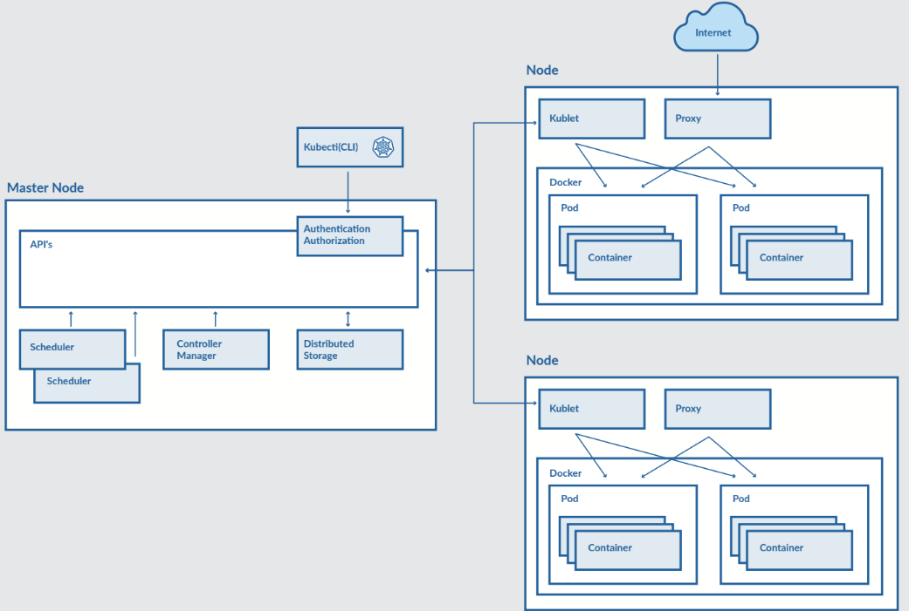

# KubeCloudOrchestrator
Projet démontrant l’orchestration d’applications multi-conteneurs avec Kubernetes, de la configuration au déploiement automatisé. Il analyse l’architecture, les avantages et les limites de Kubernetes face à Docker et aux machines virtuelles.

[TOC]

# ARCHITECTURE DE KUBERNETES [[2]](#ref2)



### Composantes principales

- Master Node (API Server, Controller Manager, Scheduler, etc.)
- Worker Nodes (Kubelet, Kube Proxy, Pod, Container Runtime)

### Fonctionnement global et communication interne

### Modèle de virtualisation et isolation des conteneurs

### Diagramme d’architecture globale

------


## **Étude de cas : Déploiement d’une application Flask avec Kubernetes **[[1]](#ref1)

### Description de l’application (exemple Flask)

### Environnement utilisé (Minikube, Docker, kubectl)


### Structure du projet 

Obtenue via la commande suivante

```bash
make tree
```

```basic
.
├── app
│   ├── app.py
│   └── __init__.py
├── conteneurs_système_de_k8s_.md
├── Dockerfile
├── Images
│   └── architecture.png
├── install_kubernetes_env.sh
├── k8s
│   ├── base
│   │   ├── configmap.yaml
│   │   ├── deployment.yaml
│   │   ├── kustomization.yaml
│   │   ├── secret.yaml
│   │   └── service.yaml
│   └── overlays
│       ├── dev
│       │   └── kustomization.yaml
│       └── prod
│           └── kustomization.yaml
├── LICENSE
├── Makefile
├── README.md
├── requirements.txt
└── run_system.sh
```

### Étapes de déploiement automatisé

- Build de l’image
- Création du cluster Minikube
- Déploiement des ressources
- Accès via service NodePort

### Vérification et tests du déploiement

------

# **Analyse critique de Kubernetes**

### Avantages

### Inconvénients et limites

### Bonnes pratiques d’utilisation

------

# **Comparaison technique**

### Kubernetes vs Docker (Docker Compose)

### Kubernetes vs Machines Virtuelles

### Tableau comparatif : Maintenance, Scalabilité, Interaction événementielle

------

# **Conclusion et perspectives**

### Synthèse des apprentissages

### Améliorations futures (CI/CD, multi-cluster, Cloud public, etc.)

------

# RÉFÉRENCES

[<a id="ref1">1</a>] [https://github.com/Bamolitho/InsideKubernetes](https://github.com/Bamolitho/InsideKubernetes)  

[<a id="ref2">2</a>] [**STRATOSCALE EVERYTHING KUBERNETES: A PRACTICAL GUIDE**](https://iamondemand.com/wp-content/uploads/2019/11/Kubernetes-eBook.pdf)  

**Tech With Nana** : https://youtu.be/-ykwb1d0DXU?si=Mny3zBcnFVE5bXBt
